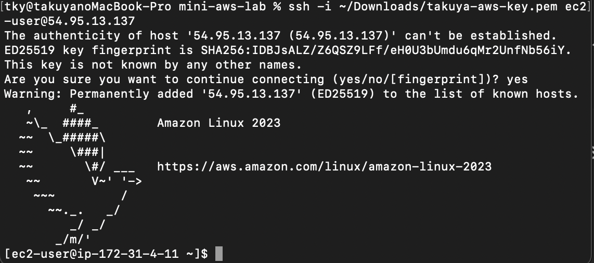
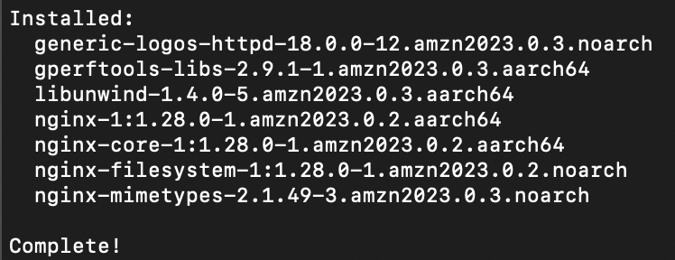
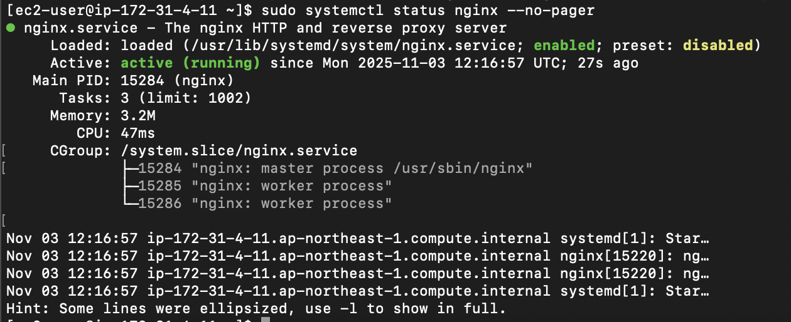

# mini-aws-lab

## 概要
AWS EC2上でNginxを構築し、HTTPアクセス確認までを行ったミニラボです。  
インスタンス作成から動作確認までの一連の流れを記録しています。

## 使用環境
- OS：Amazon Linux 2023 (Free Tier)
- インスタンスタイプ：t2.micro
- リージョン：ap-northeast-1 (東京)
- Webサーバー：Nginx 1.28
- 接続方法：SSH（秘密鍵認証）

## 構築手順

### パッケージ更新とNginxのインストール
```bash
sudo dnf update -y
sudo dnf install nginx -y

## 実行結果

| 内容 | スクリーンショット |
|------|--------------------|
| EC2接続 |  |
| Nginxインストール開始 |  |
| Nginxインストール完了 |  |
| Nginxステータス確認 |  |
| ブラウザアクセス |  |
